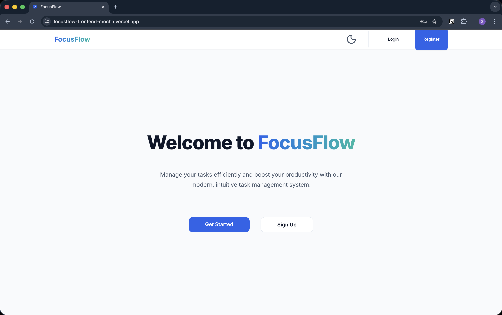
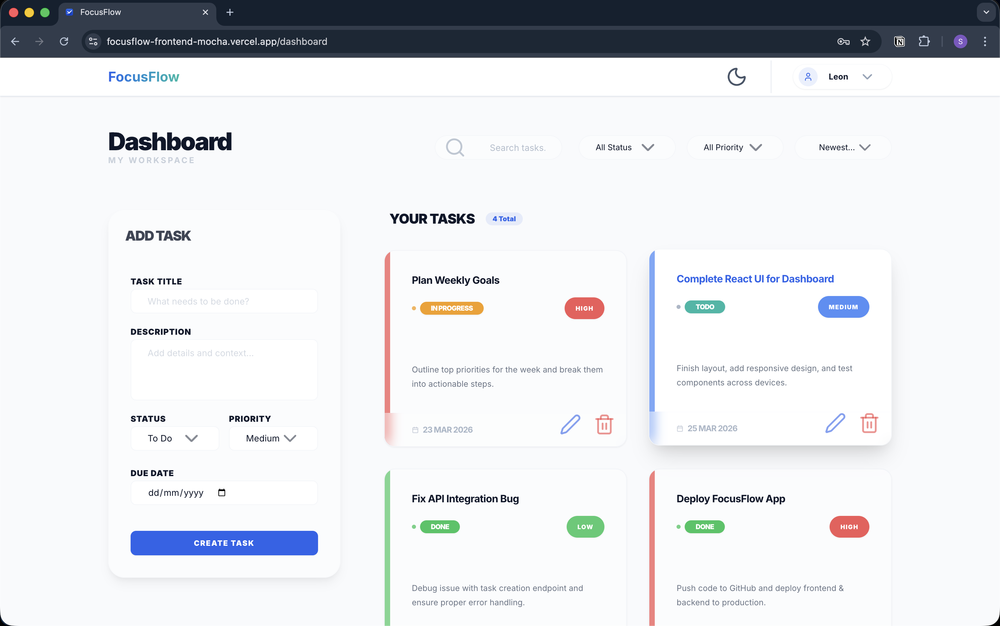
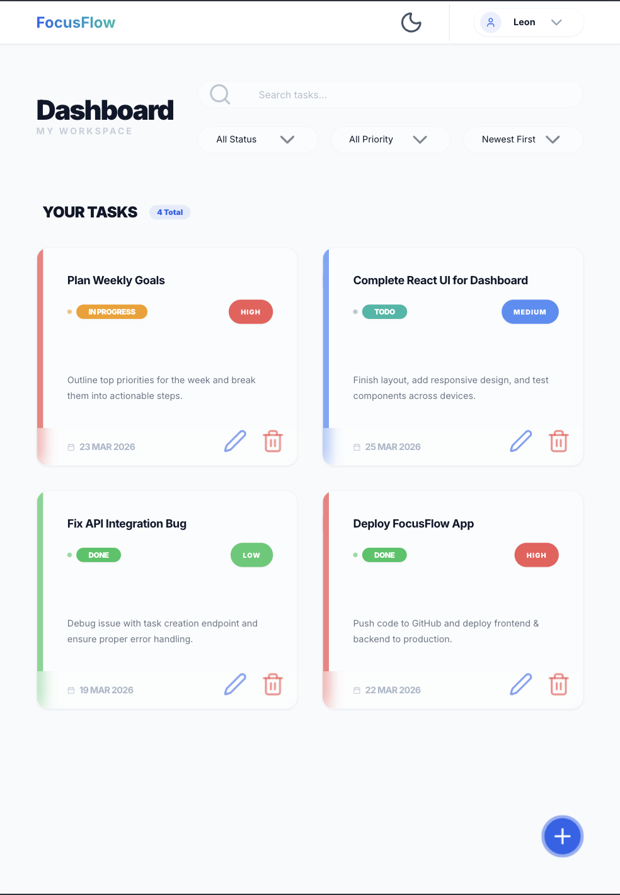
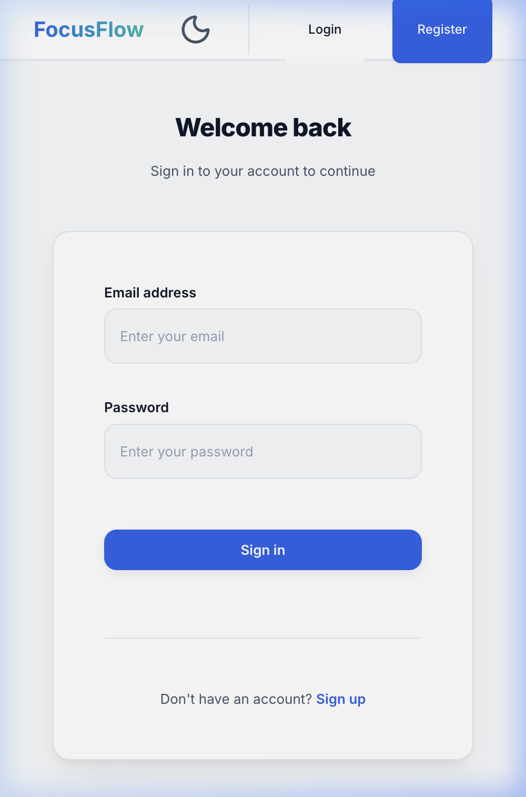

# 🌊 FocusFlow

**FocusFlow** is a high-performance, modern task management dashboard designed for peak productivity. Built with a focus on speed, aesthetics, and user experience, it provides a seamless interface for managing your daily workflow.

---

## 🌐 Live Demo

Check out the live application here: **[FocusFlow Live](https://focusflow-frontend-mocha.vercel.app/)**

---

## 📸 Screenshots

### Landing Page


### Dashboard (Desktop)


### Dashboard (Tablet)


### Login Page


---

## ✨ Key Features

- **🚀 Premium Dashboard**: A beautiful, high-tension interface for managing tasks.
- **🛠️ Full CRUD Operations**: Create, view, edit, and delete tasks with ease.
- **🔍 Advanced Filtering**: Filter tasks by status, priority, or search keywords.
- **📱 Responsive Design**: Fully optimized for mobile, tablet, and desktop views.
- **🌗 Theme Intelligence**: Built-in support for Light and Dark modes with system sync.
- **⚡ Real-time Feedback**: Instant notifications for all actions via React Hot Toast.
- **📄 Pagination**: Smooth handling of large task lists.

---

## 🛠️ Tech Stack

### Frontend
- **Framework**: [Next.js 15+](https://nextjs.org/) (App Router)
- **Library**: [React 19](https://react.dev/)
- **Language**: [TypeScript](https://www.typescriptlang.org/)
- **Styling**: [Tailwind CSS 4](https://tailwindcss.com/)
- **Components**: [Radix UI](https://www.radix-ui.com/)
- **Icons**: [Lucide React](https://lucide.dev/)

### State & Utilities
- **Transitions/Animations**: [Framer Motion](https://www.framer.com/motion/) (if used) / Radix Primitives
- **API Handling**: [Axios](https://axios-http.com/)
- **Notifications**: [React Hot Toast](https://react-hot-toast.com/)
- **Class Merging**: `tailwind-merge`, `clsx`, `class-variance-authority`

---

## 🚀 Getting Started

### Prerequisites
- Node.js 18.x or higher
- npm / yarn / pnpm

### Installation

1. **Clone the repository**:
   ```bash
   git clone https://github.com/your-username/focusflow.git
   cd focusflow
   ```

2. **Install dependencies**:
   ```bash
   npm install
   ```

3. **Set up environment variables**:
   Create a `.env.local` file in the root directory and add your backend API URL:
   ```env
   NEXT_PUBLIC_API_URL=your_api_url_here
   ```

4. **Run the development server**:
   ```bash
   npm run dev
   ```

5. **Open the app**:
   Navigate to [http://localhost:3000](http://localhost:3000) to see the application in action.

---

## 📁 Project Structure

```text
src/
├── app/            # Next.js App Router (Pages & Layouts)
├── components/     # Reusable UI Components
│   ├── ui/         # Base Radix + Tailwind components
│   └── ...         # Feature-specific components
├── context/        # React Context (Auth, Theme, etc.)
├── hooks/          # Custom React Hooks
├── services/       # API services and Axios configuration
├── types/          # TypeScript interfaces and types
└── utils/          # Helper functions and utilities
```

---

## 📄 License

This project is licensed under the MIT License.

---

Developed with ❤️ by [Selvaajeeth](https://github.com/selvaajeeth)
